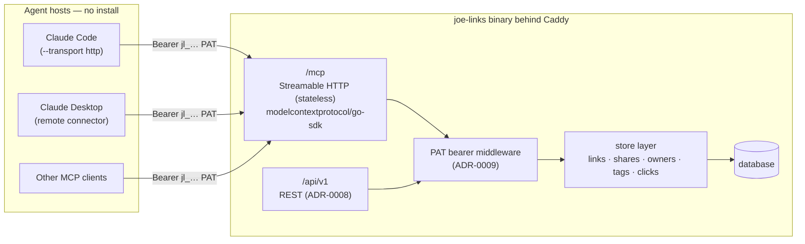

# ADR-0018: MCP Server — In-Process Streamable HTTP Endpoint for Agent Access

## Context and Problem Statement

AI agents (Claude Code sessions, scheduled cloud agents, and other MCP clients) are becoming first-class users of joe-links: they want to create short links for content they produce, look links up, and share links with humans — conversationally, without screen-scraping the HTMX UI or hand-rolling REST calls. The Model Context Protocol (MCP) is the standard way agents discover and invoke tools. How should joe-links expose its link-management capabilities to MCP clients?

joe-links already has a complete REST API at `/api/v1` (ADR-0008) authenticated by personal access tokens (ADR-0009), covering links, tags, shares, co-owners, stats, and LLM metadata suggestions. The MCP question is therefore purely one of *packaging*: where does the MCP server run, what transport does it speak, and how does it authenticate?

## Decision Drivers

* **Zero per-agent installation** — agents run on multiple machines (laptop, cloud runners, containers); requiring a local binary or npm package on each host multiplies setup and version-skew problems.
* **Reuse existing auth** — PATs (`jl_` prefix, SHA-256 hashed, `Authorization: Bearer`) already exist with a management UI; a second credential system or an OAuth dance is unwarranted complexity for a self-hosted single-tenant service.
* **One authorization code path** — the 2026-07 review (issues #191–#215) found several bugs caused by the UI and REST surfaces implementing authorization independently (e.g. #202, #193). A third surface must not re-implement these rules; it must call the same code.
* **Single-binary philosophy** — the project ships one Go binary; a sidecar service or separate repo fights the deployment model (Docker image + Caddy on ie01).
* **Client compatibility** — must work with Claude Code (`claude mcp add --transport http … --header`), Claude Desktop remote connectors, and generic MCP clients.
* **Maintainability** — prefer an official, actively maintained SDK over hand-rolled JSON-RPC.

## Considered Options

* **Option 1: In-process Streamable HTTP MCP endpoint** — mount `/mcp` on the existing chi router inside the joe-links binary, implemented with the official `modelcontextprotocol/go-sdk`, authenticated by the existing PAT bearer middleware.
* **Option 2: stdio MCP subcommand** — `joe-links mcp` in the same binary, speaking MCP over stdio and acting as a remote client of the REST API (server URL + PAT from env/flags).
* **Option 3: External wrapper package** — a separate TypeScript/npm (or Go) MCP server that wraps the REST API, published independently.

## Decision Outcome

Chosen option: **Option 1 — in-process Streamable HTTP endpoint at `/mcp`**, because it is the only option with zero per-agent footprint (any MCP client anywhere reaches `https://go.stump.rocks/mcp` with a PAT header), it reuses the PAT middleware and store-layer authorization verbatim instead of adding a third divergent surface, and it keeps the single-binary deployment story intact. The official `modelcontextprotocol/go-sdk` is used (Go 1.24 already satisfies its toolchain requirement); the endpoint runs in **stateless JSON mode** (each POST self-contained, no server-held session affinity) so it stays trivially proxyable behind Caddy and safe to restart.

Option 2 is explicitly kept open as a cheap future addition — the same tool definitions can be re-exported over a stdio transport for clients that cannot speak HTTP — but it is not part of this decision's scope.

### Consequences

* Good, because agent onboarding is one command: `claude mcp add --transport http joe-links https://go.stump.rocks/mcp --header "Authorization: Bearer jl_…"`.
* Good, because identity, rate exposure, and revocation are exactly the PAT lifecycle that already exists (revoke the token in the UI → agent loses access).
* Good, because MCP tool handlers share the store/service layer with `/api/v1`, so visibility and ownership rules cannot drift between surfaces (the class of bug found in #193/#202).
* Good, because the agent-account pattern already used elsewhere in this infrastructure (a dedicated `joestump-agent` identity) maps cleanly: mint that user a PAT and agent-created links have their own owner, with sharing/co-ownership used to hand links to humans.
* Neutral, because stateless mode forgoes MCP server-initiated features (sampling, subscriptions) — none are needed for v1 tools.
* Bad, because stdio-only MCP clients need a bridge (e.g. `mcp-remote`) until Option 2 ships.
* Bad, because the server binary takes on a new dependency (`modelcontextprotocol/go-sdk`) and a new public route whose protocol version tracking (MCP spec revisions) becomes a maintenance obligation.

### Confirmation

* `internal/mcp/` package with `// Governing: ADR-0018, SPEC-0018 REQ …` comments; tool handlers MUST call the same store methods as their REST counterparts (enforced in code review).
* Integration test: seed a user + PAT, POST `initialize`/`tools/list`/`tools/call` to `/mcp`, assert tool inventory and that an unauthenticated request gets 401 with `WWW-Authenticate`.
* `docs-site` gains an "Agents (MCP)" guide whose examples are exercised manually at release.

## Pros and Cons of the Options

### Option 1: In-process Streamable HTTP endpoint

The chi router mounts the go-sdk's Streamable HTTP handler at `/mcp`, behind the existing bearer-token middleware; tools are thin adapters over the store layer.

* Good, because zero installation on agent hosts; works from any machine that can reach the server.
* Good, because auth, TLS, logging, metrics, and deployment are all inherited from the existing server.
* Good, because one implementation of authorization rules (store layer) serves UI, REST, and MCP.
* Good, because the official Go SDK supports Streamable HTTP + stateless mode out of the box.
* Neutral, because MCP protocol-version churn is absorbed by SDK upgrades.
* Bad, because clients limited to stdio need an adapter until a stdio mode exists.
* Bad, because a malformed-request or DoS surface is added to the public server (mitigated: auth required before any tool dispatch; same exposure class as `/api/v1`).

### Option 2: stdio subcommand (`joe-links mcp`)

The binary runs locally per agent, speaking stdio to the client and REST to the server.

* Good, because it matches the classic Claude Desktop local-server configuration with no HTTP bridge.
* Good, because it lives in the same repo/binary — no new artifact.
* Bad, because every agent host needs the binary installed, configured, and upgraded (version skew across Joe's machines and cloud runners).
* Bad, because it duplicates the API surface as a *client* — request/response mapping code that can drift from the server, in exactly the way this codebase has already been bitten (#202).
* Bad, because credentials end up in per-host MCP config files rather than one place.

### Option 3: External wrapper (npm/TypeScript or separate Go repo)

A standalone MCP server package wrapping the REST API.

* Good, because it follows a common ecosystem pattern and could be published for other joe-links users.
* Good, because server deploys are decoupled from MCP iteration.
* Bad, because it introduces a second repo/toolchain (Node) to a deliberately single-binary Go project.
* Bad, because it has all of Option 2's drift and distribution problems, plus release coordination between two artifacts.
* Bad, because self-hosted users must now trust and run a second component.

## Architecture Diagram

## More Information

* Extends ADR-0008 (REST API layer) and ADR-0009 (PAT authentication); the MCP endpoint is a peer surface to `/api/v1`, not a replacement.
* Related: ADR-0017 — the LLM metadata-suggestion capability is exposed as an MCP tool so agents get slug/title/tag proposals for free.
* Requirements are formalized in SPEC-0018 (Agent Access via MCP).
* MCP Streamable HTTP transport and authorization guidance: https://modelcontextprotocol.io/specification — the endpoint returns `401` + `WWW-Authenticate` for missing/invalid tokens per the spec's HTTP auth expectations.
* Sharing semantics for the headline use case ("agent creates a link and shares it with me") rely on existing SPEC-0010 visibility modes: agents SHOULD create links as their own PAT identity and use share/co-owner tools to grant humans access.
