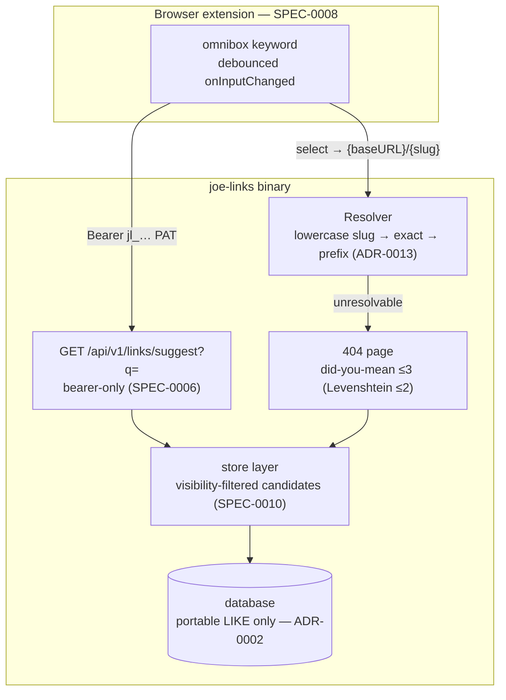

# ADR-0019: Search & Discovery — Suggest Endpoint, Did-You-Mean 404s, Case-Insensitive Resolution, Omnibox

## Context and Problem Statement

joe-links resolves slugs by exact string match. Users who almost know a slug get a bare 404: typing `go/Jira` (capitalized by a phone keyboard), `go/standup-notes` when the link is `standup`, or a typo like `go/jria` all dead-end on the 404 page with only a "Create it now" CTA. There is also no way to discover links while typing — the browser extension (ADR-0012) can redirect `go/slug` searches but offers no completions, and the only search surfaces are the dashboard and the public browser, both full page loads.

Epic #218 adds a discovery layer: (a) an autocomplete "suggest" capability, (b) "Did you mean go/…?" suggestions on the 404 page, (c) case-insensitive slug resolution, (d) an API endpoint shape for suggestions, and (e) omnibox integration in the browser extension. Every one of these must respect the visibility model (ADR-0014 / SPEC-0010): suggestions are a discovery surface, and discovery is exactly what `private` and `secure` visibility exist to prevent. A suggestion feature that leaks the existence of another user's private slug is a security regression, not a UX win.

Constraints inherited from prior decisions: the store must remain portable across sqlite3, mysql, and postgres with no driver-specific SQL or extensions (ADR-0002); the REST API is bearer-token-only with no session fallback (ADR-0009 / SPEC-0006); the extension already holds a server base URL and PAT and discovers server config via `GET /api/v1/config` (ADR-0012 / SPEC-0008); resolution already performs multi-segment prefix matching for variable links (ADR-0013).

## Decision Drivers

* **No visibility leaks** — suggestion and did-you-mean surfaces MUST be filtered to what the viewer could already discover; anonymous visitors may only ever see public slugs (ADR-0014).
* **Database portability** — matching must work identically on sqlite3, mysql, and postgres; no `pg_trgm`, no FTS5, no driver-conditional SQL (ADR-0002).
* **Scale honesty** — a self-hosted instance has hundreds to low-thousands of links, not millions; per-request in-Go computation over a bounded candidate set is cheap, and pre-built indexes or caches are unwarranted complexity.
* **One authorization code path** — visibility filtering must live in the store layer shared by UI, REST, and MCP (the lesson of #193/#202, reaffirmed by ADR-0018).
* **Latency budget** — omnibox suggestions feel broken above ~200 ms server time; the suggest query must be a single indexed-friendly SQL round trip.
* **Zero-config extension UX** — omnibox must reuse the extension's existing base URL + PAT storage and degrade gracefully when no PAT is configured (SPEC-0008).
* **Don't disturb resolution precedence** — keyword host routing (ADR-0011), path-based keyword routing, exact-match-first, and prefix matching for variables (ADR-0013) must keep their existing order.

## Considered Options

Five sub-decisions, each with its own options:

* **(a) Suggest matching strategy**: SQL prefix + `LIKE` with in-handler ranking · trigram/FTS extensions · in-memory search index
* **(b) Did-you-mean algorithm**: bounded Levenshtein in Go over viewer-visible slugs · SQL trigram similarity · precomputed n-gram index
* **(c) Case-insensitivity**: lowercase at the resolver lookup layer · DB collation change · store both-case rows
* **(d) Endpoint shape**: new `GET /api/v1/links/suggest?q=` · reuse `GET /api/v1/links?q=`
* **(e) Omnibox auth/config**: reuse extension PAT + config discovery · separate anonymous suggest access

## Decision Outcome

Chosen: **(a) portable SQL prefix/`LIKE` candidate query with in-handler ranking; (b) bounded Levenshtein distance computed in Go per 404; (c) lowercase the incoming slug at the resolver before lookup; (d) a new `GET /api/v1/links/suggest?q=` endpoint; (e) omnibox reuses the extension's stored PAT and existing config discovery.**

### (a) Suggest matching: portable SQL + in-handler ranking

The suggest query issues one SQL statement using only ANSI-portable operators: `slug LIKE '{q}%'` (prefix, index-friendly on the existing unique slug index) unioned with `slug LIKE '%{q}%' OR lower(title) LIKE '%{q}%' OR lower(description) LIKE '%{q}%'`, visibility-filtered in the same store method, capped at a small candidate limit. The incoming `q` is lowercased server-side before matching: stored slugs are canonically lowercase (SPEC-0002) and `LIKE` case-sensitivity differs per driver (postgres is case-sensitive; sqlite and mysql defaults are not), so lowercasing `q` and comparing against the lowercase corpus — with `lower(title)`/`lower(description)` on the other arms — is what makes matching identical across all three drivers. Final ordering happens in the Go handler: exact slug prefix first, then slug substring, then title/description matches, ties broken deterministically. `LIKE` wildcards in user input are escaped. No trigram extension, no FTS virtual tables — those are per-driver features that break ADR-0002's portability contract (`pg_trgm` is postgres-only, FTS5 is sqlite-only, mysql fulltext has its own dialect), and at hundreds of links a `LIKE` scan is microseconds.

### (b) Did-you-mean: bounded Levenshtein in Go, computed per 404, nothing cached

On an unresolvable slug, the 404 handler fetches the slugs *resolvable-and-discoverable by the viewer* (store-layer visibility filter — anonymous: public only; authenticated: public + own/co-owned + shared; admin: all) and computes plain Levenshtein edit distance in Go. Bounds keep it O(small): only candidate slugs whose length is within ±2 of the query are considered, only distance ≤ 2 qualifies, and at most 3 suggestions render, best-distance first. Nothing is cached or precomputed — a 404 is a cold path, the candidate set is small, and cache invalidation on link CRUD would be more code than the computation. SQL trigram similarity was rejected for the same portability reasons as (a); a precomputed n-gram index is a solution for a corpus three orders of magnitude larger than any joe-links deployment.

### (c) Case-insensitivity: lowercase at the resolver lookup layer

Slugs are already canonically lowercase at rest: `ValidateSlugFormat` (internal/store/validate.go) rejects any slug containing uppercase on create/update, so the `links.slug` column contains only lowercase values — but `LinkStore.GetBySlug` compares exactly, so `/Jira` 404s today. The fix is one-sided: the resolver lowercases the candidate slug/prefix before calling `GetBySlug`; the store and schema are untouched. A DB collation change (`COLLATE NOCASE` / `_ci` collations / `citext`) was rejected because collation syntax and semantics differ per driver (violating ADR-0002), would require a migration touching a uniquely-indexed column, and solves a problem the write path has already solved by construction. Variable values in multi-segment paths (ADR-0013) are *not* lowercased — only the slug-prefix portion is — so `go/jira/PROJ-123` still substitutes `PROJ-123` verbatim.

### (d) A new endpoint: `GET /api/v1/links/suggest?q=`

`GET /api/v1/links` cannot serve autocomplete: its visibility scope is wrong (owned/co-owned/shared only — it deliberately excludes other users' public links, which suggestions must include), its payload is heavy (full link resources plus a pagination envelope), and widening the list endpoint's scope for a `q` parameter would silently change what existing API consumers see. A dedicated `GET /api/v1/links/suggest?q=` returns a minimal `{slug, title}` array with its own broader-but-safe visibility scope and its own result cap. It shares the `/links/suggest` path with SPEC-0017's LLM metadata endpoint but is method-disambiguated (`GET` = cheap autocomplete over existing links; `POST` = generative metadata for a new link); chi and swaggo both distinguish operations by method. Per SPEC-0006, the endpoint — like all of `/api/v1` — accepts **bearer tokens only**; unauthenticated and session-cookie requests get 401. Anonymous suggestion needs (the public 404 page) are served by the server-rendered did-you-mean block, not by opening this endpoint.

### (e) Omnibox reuses the extension's PAT and config discovery

The extension registers a manifest `omnibox` keyword and answers `onInputChanged` by calling `{baseURL}/api/v1/links/suggest` with the stored PAT (`Authorization: Bearer`), debounced, mapping the top 5 results to omnibox suggestions; selecting one navigates to the resolver URL `{baseURL}/{slug}` so server-side visibility enforcement still governs the actual redirect. With no PAT configured, the omnibox makes no network calls and shows only a default suggestion (SPEC-0008's unauthenticated mode, applied to a surface that requires auth). This follows the SPEC-0008 precedent exactly: base URL + PAT from `chrome.storage`, server config from `GET /api/v1/config` — no second credential, no new storage schema.

### Consequences

* Good, because typo'd and mis-cased slugs recover instead of dead-ending: `/Jira` resolves, `/jria` offers "Did you mean go/jira?".
* Good, because every discovery surface funnels through one store-layer visibility filter, so suggestions can never show a slug the viewer couldn't already find by browsing — anonymous users only ever see public slugs, and secure/private existence is not leaked (the #248 tag-autocomplete visibility bug class is designed out from the start).
* Good, because everything is portable ANSI SQL plus in-process Go — no extensions, no migrations, no new dependencies beyond a ~30-line Levenshtein function.
* Good, because omnibox onboarding is zero-config for existing extension users: same base URL, same PAT, keyword works immediately.
* Neutral, because ranking quality is basic (prefix > substring > title); at self-hosted scale that is sufficient, and the ranking lives in one handler if it ever needs improving.
* Bad, because `GET` and `POST /api/v1/links/suggest` mean two different things ("autocomplete existing" vs "generate metadata"); mitigated by explicit swagger summaries, but a future v2 API should split the paths.
* Bad, because substring `LIKE` on title/description cannot use an index; acceptable at this scale, and the slug-prefix arm remains index-friendly.
* Bad, because per-404 Levenshtein does per-request work proportional to the viewer-visible link count; bounded by the ±2-length pre-filter and fine below tens of thousands of links.

### Confirmation

* `internal/store` gains a suggest/candidate method with `// Governing: SPEC-0019 REQ …` comments; handlers MUST NOT filter visibility themselves (code review).
* Resolver tests: `/JIRA` and `/Jira` resolve the `jira` link; `go/jira/PROJ-123` preserves variable case; keyword routing precedence unchanged.
* 404 tests: anonymous request near a private/secure slug gets no suggestion for it; owner gets suggestions for their own private slugs; max 3 rendered.
* API tests: `GET /api/v1/links/suggest` returns 401 without a bearer token, filters visibility per role, caps results; swagger regenerated via `make swagger`.
* Extension tests: debounce fires one request for rapid keystrokes; no-PAT mode issues zero suggest requests; suggestion descriptions are XML-escaped.

## Pros and Cons of the Options

### (a) Trigram / FTS extensions (rejected)

`pg_trgm` similarity or sqlite FTS5 / mysql FULLTEXT for fuzzy candidate generation in SQL.

* Good, because fuzzy matching quality is excellent and computed close to the data.
* Bad, because every driver needs a different implementation (or the feature silently degrades per driver), breaking ADR-0002's single-SQL contract.
* Bad, because extensions require migration steps and, for postgres, superuser `CREATE EXTENSION` that self-hosters may not have.
* Bad, because it optimizes for corpus sizes joe-links will never reach.

### (a/b) In-memory search index (rejected)

Load all slugs into a process-resident index (e.g. a trie or bigram map) refreshed on link CRUD.

* Good, because lookups are sub-microsecond and independent of SQL dialects.
* Bad, because it introduces cache-invalidation state into a deliberately stateless request path, and visibility filtering would have to be re-implemented against the index — a second authorization code path, the exact bug class ADR-0018 warns about.

### (b) SQL trigram similarity for did-you-mean (rejected)

Same portability failure as (a); additionally the 404 path is the coldest path in the system, so optimizing it with driver-specific SQL is backwards.

### (c) Database collation change (rejected)

* Good, because lookups become case-insensitive with no application change.
* Bad, because `COLLATE NOCASE` (sqlite), `utf8mb4_…_ci` (mysql), and `citext`/`ILIKE` (postgres) are three different mechanisms with three different Unicode behaviors — per-driver migrations for a write path that already guarantees lowercase.
* Bad, because collation changes on a uniquely-indexed column risk rebuild surprises on existing deployments.

### (d) Reuse `GET /api/v1/links?q=` (rejected)

* Good, because no new route or swagger surface.
* Bad, because the list endpoint's visibility scope (owned/co-owned/shared) excludes other users' public links, which suggestions need; widening it changes existing consumers' results.
* Bad, because full link resources + pagination envelope are the wrong payload for a per-keystroke call.
* Bad, because ranking semantics (prefix-first) would overload the list endpoint's stable ordering contract.

### (e) Anonymous omnibox suggest access (rejected)

Letting the omnibox query suggestions without a PAT (public links only).

* Good, because omnibox would work before any configuration.
* Bad, because it would require opening an unauthenticated enumeration surface on `/api/v1`, contradicting SPEC-0006's posture, for a marginal UX gain — extension users configuring a PAT is already the documented path (SPEC-0008).

## Architecture Diagram

## More Information

* Requirements are formalized in SPEC-0019 (Search & Discovery); epic tracked as issue #218.
* Extends ADR-0002 (database portability — the constraint that shaped options (a)–(c)), ADR-0007 (views/routing — the 404 page), ADR-0008 (REST API layer), ADR-0009 (bearer-only API auth posture governing the suggest endpoint), ADR-0012 (browser extension), ADR-0013 (multi-segment resolution the case-folding must not disturb), and ADR-0014 (visibility modes that bound every discovery surface).
* Related: ADR-0017 / SPEC-0017 (the *other* `/links/suggest` operation, `POST`, generative metadata); ADR-0011 (keyword routing precedence, unchanged).
* Prior art in-repo: the tag autocomplete surface hardened in #248 (visibility filtering + output escaping) is the cautionary precedent for this ADR's "filter in the store, escape at the edge" stance.
