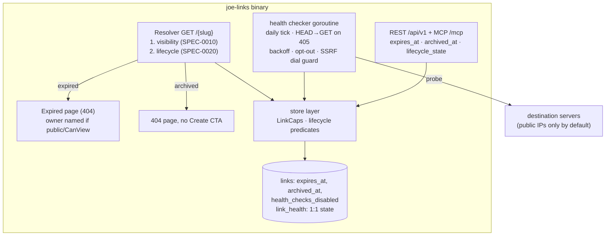

# ADR-0020: Link Lifecycle — Expiration, Archiving, and Dead-Link Detection

## Context and Problem Statement

Links in joe-links are forever. There is no way to expire a temporary link (an incident doc, a sprint board, an event page), no way to take a link out of service while keeping its slug reserved and its stats intact, and no signal when a destination has rotted — `go/handbook` can 404 for months before anyone notices. For a go-links service, dead links erode the core trust proposition: `go/x` always works.

Epic #217 adds a lifecycle layer: (1) optional expiration (`expires_at`) with owner-visible "expired" badges and one-click renewal, (2) an archive/disable toggle distinct from delete, (3) periodic dead-link detection with a "broken" badge and an admin report, (4) staleness views ("no clicks in 90d", "created but never clicked"), and (5) lifecycle state in API and MCP responses — explicitly **no webhooks in v1**.

Constraints inherited from prior decisions: the store must remain portable across sqlite3, mysql, and postgres (ADR-0002 — and migration 00015 is the cautionary tale for dialect-specific schema changes); the resolver's visibility semantics (ADR-0014 / SPEC-0010) must not be disturbed, and no lifecycle surface may become an existence oracle for secure or private slugs; long-running background work already has an in-process precedent (the click writer and gauge updater goroutines in `cmd/joe-links/serve.go`, ADR-0016); UI, REST, and MCP must never disagree on authorization (`LinkCaps` in `internal/store/auth.go`, reaffirmed by ADR-0018); and all config is viper-loaded with the `JOE_` prefix. One new hazard is introduced here: the health checker is the **first server-side fetcher of user-supplied URLs** in joe-links — today the server only redirects browsers to destinations and never fetches them itself (`internal/store/validate.go` validates slugs, text lengths, and visibility, but destination URLs are not scheme- or host-validated anywhere), so the checker creates an SSRF surface that did not previously exist.

## Decision Drivers

* **Portability** — schema changes must apply identically on sqlite3, mysql, and postgres with plain SQL; anything requiring per-dialect surgery (see migration 00015's three-way FK rebuild) is a last resort (ADR-0002).
* **No existence oracles** — an anonymous visitor must not learn that a secure slug exists via a distinct "expired" or "archived" page (ADR-0014 / SPEC-0010; the discoverability stance SPEC-0019 formalized).
* **One derivation of truth** — lifecycle state should be computable from stored facts, never a second column that can drift out of sync with the facts.
* **Politeness** — the checker fetches other people's servers; it must not hammer (bounded frequency, backoff on failure, opt-out per link), and it must apply the HEAD lesson joe-links itself learned in #196 (many servers mis-handle HEAD).
* **SSRF containment** — server-side fetching of user-supplied URLs must not become a probe into the deployment's private network, while acknowledging that self-hosters legitimately shortlink internal services.
* **One authorization code path** — who may expire/archive/renew must come from `LinkCaps`, shared by web, REST, and MCP (ADR-0018).
* **Operational simplicity** — single binary, no external scheduler dependency (ADR-0016's in-process precedent).

## Considered Options

Five sub-decisions, each with its own options:

* **(a) Lifecycle schema**: nullable `expires_at` + `archived_at` timestamps with derived state · a `status` enum column · a lifecycle-events table
* **(b) Resolver semantics**: visibility gates first, then lifecycle, HTTP 404 with styled pages · lifecycle checked before visibility · `410 Gone` status
* **(c) Checker architecture**: in-process ticker goroutine + separate `link_health` table · external cron invoking an endpoint · health state columns on `links`
* **(d) SSRF posture**: block private-network destinations at dial time by default, with a config escape hatch · no blocking · validate destinations at link creation
* **(e) Authorization and parity**: reuse `LinkCaps` (`CanEdit` gates lifecycle writes) with REST/MCP parity · new lifecycle-specific permission checks

## Decision Outcome

Chosen: **(a) two nullable timestamps, `expires_at` and `archived_at`, with lifecycle state derived at read time; (b) visibility gates run first, lifecycle second, both terminal lifecycle states respond HTTP 404 with styled pages; (c) an in-process ticker goroutine writing to a separate `link_health` table; (d) private-network destinations blocked at dial time by default with `JOE_HEALTH_CHECK_ALLOW_PRIVATE` as the self-hoster escape hatch; (e) `LinkCaps.CanEdit` gates all lifecycle writes, with full REST/MCP parity.**

### (a) Schema: `expires_at TIMESTAMP NULL` + `archived_at TIMESTAMP NULL`, state derived — no enum column

Two nullable timestamp columns are added to `links` (goose migrations from `00016` on, plain SQL — per-story migrations are acceptable): `expires_at` and `archived_at`, plus `health_checks_disabled BOOLEAN NOT NULL DEFAULT FALSE` for the checker opt-out. Lifecycle state is **derived**: `archived` when `archived_at` is non-null, else `expired` when `expires_at <= now()`, else `active`. There is no `status` column. The timestamps are strictly more informative than an enum (they say *when*, which the UI needs for "expired 3 days ago" and the checker needs for skipping), and — decisively — expiry is a *function of time*, so an enum would need a background job to flip rows from `active` to `expired` at exactly the right moment, plus reconciliation when `expires_at` is edited; deriving `expires_at <= now` at read time needs nothing and can never be stale. A status enum is also a second source of truth that can disagree with the timestamps, and enum/CHECK enforcement is dialect-divergent (MySQL `ENUM` is proprietary; SQLite `CHECK` cannot be altered without a table rebuild — the exact class of pain migration 00015 documents). `ADD COLUMN` of nullable/defaulted columns is the one schema change all three dialects perform identically with no rebuild, keeping the lifecycle migrations plain portable SQL files (contrast 00015's per-dialect Go migration). Renewal is trivially expressed: set `expires_at` to `NULL` (or a new future time). Archive and expiry are independent facts; a link may be both, and `archived` wins in the derived state.

### (b) Resolver semantics: visibility first, lifecycle second; 404 status with styled pages

The resolver's evaluation order is pinned: **SPEC-0010 visibility enforcement runs first, exactly as today, and lifecycle checks run only after the visibility gate passes.** For a secure link this means an anonymous visitor is redirected to login and an unauthorized user gets 403 *whether or not the link is expired or archived* — the lifecycle of a secure link is disclosed only to viewers already authorized to resolve it. This ordering is what prevents the new "expired" page from becoming an existence oracle: if lifecycle ran first, an anonymous probe of a secure slug would render a distinct expired page and confirm the slug exists. For public and private links, the styled expired page is shown to anyone who presents the slug — acceptable because presenting a private slug already resolves it today (SPEC-0010: private is a discoverability control, not an access control), so the page reveals nothing a slug-holder could not already learn.

Both terminal states respond **HTTP 404**, not `410 Gone`: 410 is semantically tempting but would make the *status code itself* distinguish "existed once" from "never existed" even where the page body is careful not to, and it diverges from SPEC-0004's single 404 contract for unresolvable paths. Expired links render a dedicated "this link has expired" page that names the owner **only when the link is public or the viewer holds `CanView`** (a private link's ownership is not a slug-holder's business); archived links render the standard 404 page — archive means "act gone" — except the Create CTA is suppressed for both states because the slug remains reserved and creation would fail on the unique index anyway. Neither state records a click event (no redirect is issued). Prefix resolution (ADR-0013) commits to the first visibility-passing match even when it is expired or archived — the lifecycle outcome terminates resolution exactly as for an exact match, naming the matched slug, with no fall-through to shorter prefixes. Owners, co-owners, admins, and share recipients continue to see the link on dashboard/detail surfaces with an "expired"/"archived" badge; renewal (clearing `expires_at`) is one click gated by `CanEdit`.

### (c) Checker: in-process ticker goroutine + separate `link_health` table

The dead-link checker runs as a goroutine started in `serve.go`, following the exact pattern of `runClickWriter`/`runGaugeUpdater` (ADR-0016): started with the server's signal-aware context, exits cleanly on shutdown, no external scheduler. An external cron would break the single-binary story (ADR-0001/ADR-0016) and require either a new authenticated trigger endpoint or a second deployment artifact; the interval is daily, so in-process cost is negligible. Config is viper/`JOE_`-prefixed: `JOE_HEALTH_CHECKS_ENABLED` (default `true`), `JOE_HEALTH_CHECK_INTERVAL` (default `24h`), `JOE_HEALTH_CHECK_TIMEOUT` (default `10s`), `JOE_HEALTH_CHECK_ALLOW_PRIVATE` (default `false`).

Probing applies joe-links' own #196 lesson from the other side: **HEAD first, fall back to GET on 405/501** (this repo had to fix its resolver because checkers sent HEAD and chi returned 405 — the checker must extend the tolerance it expects). Politeness is normative in SPEC-0020: bounded concurrency, spacing between requests to the same host, capped redirect-following, capped GET body reads, `429`/`Retry-After` respected and never counted as broken, exponential backoff of the next-check time for failing links, "broken" only after ≥ 3 consecutive failures, and a per-link owner opt-out. Variable links (SPEC-0009 `$var` templates) are skipped — their destination is a template, not a URL.

Health state lives in a **separate `link_health` table** (`link_id` PK/FK ON DELETE CASCADE, last check time/status/error, consecutive failures, next-due time, and a skipped flag for destinations that are not checkable under current policy), not columns on `links`. Justification: this is machine-written, high-churn operational state, and `links` is the hot table read on every resolution and list render — keeping checker writes off it avoids write contention, avoids corrupting `updated_at` semantics (a health probe is not an edit), keeps `LinkStore` scans narrow, and makes the down migration a clean `DROP TABLE` instead of per-dialect column drops (SQLite `DROP COLUMN` support is version-sensitive — again the 00015 lesson). The opt-out flag, by contrast, *is* owner intent edited through the link form, so it belongs on `links` with the other timestamps. A row in `link_health` is upserted per check; absence of a row means "never checked". "Broken" is derived (`consecutive_failures >= 3`), not stored — same no-drift principle as (a).

### (d) SSRF: block private-network destinations at dial time by default

The checker refuses non-http(s) schemes and, by default, refuses to connect to loopback, RFC 1918, link-local, unique-local, CGNAT, "this network" (`0.0.0.0/8`), unspecified, multicast, and NAT64-mapped addresses — a deny-by-default classifier built on the standard library's address predicates rather than a hand-maintained CIDR list, with IPv4-mapped IPv6 addresses unmapped to their v4 form before classification (`::ffff:127.0.0.1` is loopback, not an unlisted v6 address). Enforcement happens **at dial time on the resolved IP** (a `DialContext` control hook), not by pre-checking DNS, so DNS-rebinding cannot bypass it; all probe traffic (HEAD, GET fallback, retries, every redirect hop) shares one guarded Transport, redirects to non-http(s) schemes are not followed, and every connection is independently gated. Because joe-links is self-hosted and `go/router → 192.168.1.1` is a legitimate homelab use, `JOE_HEALTH_CHECK_ALLOW_PRIVATE=true` disables the block deliberately and globally — an explicit operator decision, not a per-link one (a per-link flag would let any link owner aim the server at the internal network). Links whose destinations are blocked are recorded as *skipped, not broken* — unchecked is not dead. Validating destinations at link *creation* was rejected as the primary control: it would retroactively invalidate existing links, break the legitimate internal-shortlink use case for resolution (browsers can reach RFC 1918 hosts the server shouldn't probe), and still not protect the checker against post-creation DNS changes. Creation-time validation may be layered on later; the dial-time control is the one that actually guards the fetch.

### (e) Authorization and parity: `LinkCaps.CanEdit` everywhere, REST/MCP parity, no webhooks

Setting or clearing `expires_at`, toggling archive, renewing, and toggling the health-check opt-out are all **edits**: gated by `LinkCaps.CanEdit` (owners, co-owners, admins) from `internal/store/auth.go` — no new permission concept. Share recipients remain read-only: they see lifecycle and health badges on links they can already view (`CanView`), and nothing else. Badges are a property of list rows the viewer is already authorized to see (SPEC-0010 filtering is unchanged); health badges are additionally restricted to viewers with capabilities on the link — the public browser and anonymous surfaces never display health information, and expired/archived links are excluded from public browsing (SPEC-0012) and from the SPEC-0019 discovery surfaces (a suggestion that dead-ends is worse than none). REST and MCP expose identical lifecycle state (per the SPEC-0018 parity precedent): link resources gain `expires_at`, `archived_at`, and derived `lifecycle_state`; `PUT /api/v1/links/{id}` and the MCP `update_link` tool accept the same lifecycle inputs. **No webhooks or event delivery in v1** — lifecycle is state in responses, not events; a webhook system is its own epic with its own retry/signing/SSRF design and is explicitly out of scope.

### Consequences

* Good, because temporary links finally expire themselves, and `expires_at <= now` derivation means expiry takes effect at the exact moment with no flip job.
* Good, because archive gives owners a reversible off switch that keeps the slug reserved and the click history intact — `DELETE` cascades `link_clicks` (SPEC-0016); archive preserves them, making the two operations meaningfully distinct.
* Good, because dead destinations surface within a day on the owner's dashboard and in one admin report, with politeness and SSRF containment designed in from the start rather than patched in.
* Good, because the lifecycle migrations (00016 on) are plain portable SQL (nullable `ADD COLUMN`s + one `CREATE TABLE`), avoiding another 00015-style per-dialect Go migration.
* Good, because visibility-first ordering means lifecycle adds zero new information leaks for secure links, and 404-for-everything keeps the status-code surface uniform.
* Neutral, because staleness views ("no clicks in 90d") are computed from `link_clicks` and will interact with the retention pruning planned in epic #216 — SPEC-0020 defines staleness against the rows that exist, and #216's retention window must stay ≥ the staleness window (or introduce a `last_clicked_at` rollup) to keep the views truthful.
* Bad, because derived expiry means "expired" rows still exist in every index and store queries must carry lifecycle predicates (public browsing, suggest, checker eligibility) — a filter that must be applied consistently in the store layer, which is where SPEC-0020 pins it.
* Bad, because an in-process checker means a multi-replica deployment would probe destinations once per replica; acceptable at self-hosted scale (single-instance is the documented topology), noted for any future HA work.
* Bad, because the private-network block is global, not per-link: a deployment that wants health checks for public destinations *and* has internal shortlinks must either allow private fetches entirely or rely on per-link opt-out for the internal ones.

### Confirmation

* The lifecycle/health migrations (`00016` on) exist in `internal/db/migrations/` as plain SQL; `make test` passes against all three drivers' migration tests.
* Resolver tests: anonymous request for an **expired secure** slug → login redirect (never the expired page); unauthorized authenticated user → 403; expired public → expired page with owner attribution; archived → 404 page without Create CTA; no click events recorded for either state.
* Checker tests: HEAD → GET fallback on 405; 429 not counted as failure; backoff schedule honored; opt-out and variable links skipped; dial to `127.0.0.1`, `::ffff:127.0.0.1`, `0.x.x.x`, and RFC 1918 refused unless `JOE_HEALTH_CHECK_ALLOW_PRIVATE=true`; redirect hops re-checked; the GET fallback uses the same guarded Transport as HEAD.
* Store methods carry `// Governing: SPEC-0020 REQ …` comments; handlers do not compute lifecycle or health state themselves (code review).
* REST/MCP parity: `expires_at`, `archived_at`, `lifecycle_state` present and identical in `GET /api/v1/links/{id}` and `get_link`; swagger regenerated via `make swagger`.

## Pros and Cons of the Options

### (a) `status` enum column (rejected)

* Good, because state is a single indexed value, trivially filterable.
* Bad, because expiry is time-derived: an enum needs a scheduled job to flip `active → expired` and reconciliation on every `expires_at` edit; until the job runs, the column is simply wrong.
* Bad, because it duplicates truth the timestamps already carry, and enum/CHECK constraint mechanics are dialect-divergent (ADR-0002; the 00015 precedent).

### (a) Lifecycle-events table (rejected)

An append-only `link_lifecycle_events` log with current state as the latest row.

* Good, because it gives a full audit trail and would suit future webhooks.
* Bad, because v1 needs current state, not history; every read becomes a latest-row subquery; and it builds infrastructure for the webhook feature this ADR explicitly defers.

### (b) Lifecycle before visibility (rejected)

* Good, because it saves a capability lookup on expired links.
* Bad, because it is the existence oracle: an anonymous probe of a secure slug would receive the expired page instead of the login redirect, confirming the slug exists — precisely what SPEC-0010's secure mode must prevent.

### (b) `410 Gone` for expired/archived (rejected)

* Good, because it is the semantically precise status and hints crawlers to deindex.
* Bad, because the status code becomes machine-readable existence disclosure independent of any page-body care, and it forks SPEC-0004's uniform 404 contract for unresolvable paths.

### (c) External cron / triggered endpoint (rejected)

* Good, because scheduling is delegated to proven infrastructure and multi-replica dedup is the operator's problem.
* Bad, because it breaks the single-binary deployment story, adds an authenticated admin trigger endpoint or second artifact, and contradicts the in-process precedent (click writer, gauge updater) that already exists for exactly this shape of work.

### (c) Health state columns on `links` (rejected)

* Good, because no join to render a badge.
* Bad, because the checker would write the hottest table in the system on every probe, muddy `updated_at`, widen every list scan, and make rollback a per-dialect column-drop exercise instead of `DROP TABLE link_health`.

### (d) No private-network blocking (rejected)

* Good, because homelab internal shortlinks get health checks with zero config.
* Bad, because any user who can create a link could steer the server into probing `169.254.169.254`, internal admin panels, or the database host — an unacceptable default for a service that may run with network access ordinary users lack.

### (e) Lifecycle-specific permissions (rejected)

* Good, because archive could in principle be delegated more narrowly than edit.
* Bad, because it forks the single `LinkCaps` matrix that web, REST, and MCP share — reintroducing the divergence bug class that `LinkCaps` exists to prevent (#193/#202, ADR-0018) for a distinction no user has asked for.

## Architecture Diagram

## More Information

* Requirements are formalized in SPEC-0020 (Link Lifecycle); epic tracked as issue #217.
* Extends ADR-0002 (database portability — the constraint shaping (a) and (c)), ADR-0005 (link data model the columns join), ADR-0007 (views/routing — the 404 and expired pages), ADR-0008 (REST API layer), ADR-0013 (URL variable substitution and prefix resolution — lifecycle outcomes commit at the first visibility-passing prefix match, and variable links are skipped by the checker), ADR-0014 (visibility modes whose ordering (b) pins), ADR-0016 (analytics — click data for staleness, and the in-process background-goroutine precedent (c) follows), ADR-0018 (MCP parity and the one-authorization-path principle (e) reuses).
* Related: issue #196 (HEAD support in the resolver — the lesson the checker's probe strategy mirrors); epic #216 (analytics v2 — its click-retention policy interacts with the staleness views, see Consequences); SPEC-0019 (discovery surfaces that must exclude expired/archived links).
* Deliberately out of scope for v1: webhooks/event delivery, per-link SSRF allowlists, creation-time destination validation, and multi-replica checker coordination.
