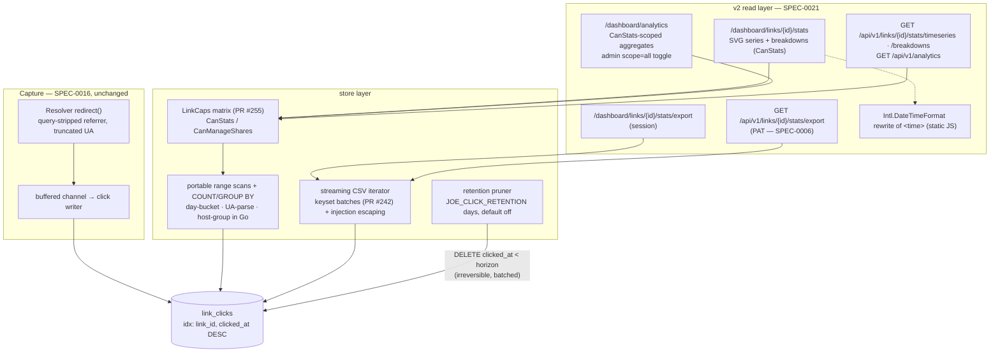

# ADR-0021: Link Analytics v2 — Time Series, Breakdowns, Exports, Retention

## Context and Problem Statement

ADR-0016 gave joe-links a solid click *capture* pipeline: an append-only `link_clicks` table (per-click rows with `ip_hash`, truncated `user_agent`, query-stripped `referrer`, nullable `user_id`), async recording off the redirect hot path, and a thin read surface — three totals (all-time / 7d / 30d), a flat recent-clicks list rendered in UTC, and two REST endpoints. The 2026-07-12 functional review (epic #216) found the read surface is where the value stops: no trends over time, no way to compare links, no view of where traffic comes from, no way to get data out, and `link_clicks` grows without bound — ADR-0016 explicitly deferred retention ("a background goroutine … can purge rows older than a configurable retention window. This is additive").

Epic #216 adds the v2 read layer: (1) a per-link daily-clicks time series chart (30/90 days) on the stats page, (2) a global analytics dashboard at `/dashboard/analytics`, (3) referrer/browser/OS/authentication breakdowns, (4) viewer-local timezone rendering of click timestamps, (5) CSV export, (6) a click-retention policy with a periodic pruner, and (7) full REST API parity for everything the UI shows.

Constraints inherited from prior decisions: the store must stay portable across sqlite3, mysql, and postgres with no driver-specific SQL in the query layer (ADR-0002 — and SQL date functions are exactly where the dialects diverge: `strftime` vs `DATE_FORMAT` vs `to_char`/`date_trunc`); the issue mandates "keep it dependency-light" for charting; `/api/v1` is bearer-token-only with no session fallback (ADR-0009 / SPEC-0006); and — critically — PR #255 just consolidated link authorization into a single capability matrix (`internal/store/auth.go` `LinkCaps`): stats are readable by owners/co-owners/admins **and** share recipients (`CanStats`), but per-click user attribution is manager-only (`CanManageShares`), because the set of authenticated clickers on a `secure` link is a proxy for the hidden share roster. Every new analytics surface is a new chance to re-leak what #255 just sealed, so each one must be pinned to that matrix here, at decision time.

## Decision Drivers

* **Database portability** — identical behavior on sqlite3, mysql, postgres; no per-dialect SQL in stores beyond the established rebind path; date/time functions are the most dialect-divergent SQL there is (ADR-0002).
* **Scale honesty** — a self-hosted go-links instance sees hundreds to low thousands of clicks per day (ADR-0016); 90 days of clicks for one link is thousands of rows, and the whole table stays in the low millions for years. Designs must be sized for that, not for a SaaS.
* **Dependency-light** — no chart library, no UA-parsing library, no timezone database shipping to the client; the issue and ADR-0001's HTMX-first stance both push server-rendered output with minimal JS.
* **One authorization code path** — every surface gates through `LinkCaps` (`internal/store/auth.go`); no handler re-derives ownership/share logic (the #193/#202 lesson, re-affirmed by ADR-0018 and PR #255).
* **No attribution leakage** — the manager-only clicker-attribution rule from PR #255 must hold across time series, breakdowns, exports, and the global dashboard; aggregates must not reconstruct the share roster.
* **Data-loss honesty** — retention pruning is irreversible deletion of source-of-truth rows; a self-hosted tool must not destroy a year of history as an upgrade side effect.
* **Redirect hot path untouched** — v2 is read-side only; the capture pipeline (SPEC-0016) does not change.

## Considered Options

Seven sub-decisions, each with its own options:

* **(a) Aggregation strategy**: on-the-fly queries with portable SQL + in-Go bucketing/grouping · per-dialect SQL date functions in the store · materialized daily rollup table
* **(b) Chart rendering**: server-rendered inline SVG from `html/template` · client-side JS chart library · hand-rolled `<canvas>` JS
* **(c) Browser/OS breakdown source**: parse stored `user_agent` at read time with a small internal parser · add parsed `browser`/`os` columns at capture time (migration + backfill) · external UA-parsing library
* **(d) Viewer-local timezones**: client-side rewrite via `Intl.DateTimeFormat` on server-stamped `<time datetime>` elements · per-user timezone setting stored server-side
* **(e) Retention default**: `JOE_CLICK_RETENTION` default **off** (opt-in) · default **on** at 365 days
* **(f) Global dashboard scope**: viewer's `CanStats` set (own + co-owned + shared-with-viewer), with an explicit admin-only all-links toggle · own/co-owned only · admins always see all links
* **(g) CSV export surface**: paired routes — session-authed dashboard route + PAT-authed `/api/v1` route sharing one streaming writer · API-only (PAT required even from the UI)

## Decision Outcome

Chosen: **(a) on-the-fly portable SQL with day-bucketing and grouping computed in Go; (b) server-rendered inline SVG; (c) read-time UA parsing with a small bounded internal parser; (d) client-side `Intl` rewrite of `<time>` elements; (e) retention default off, opt-in via `JOE_CLICK_RETENTION` in days; (f) dashboard scoped to the viewer's `CanStats` set with an admin-only `scope=all` toggle; (g) paired export routes sharing one streaming CSV writer.**

### (a) Aggregation: on-the-fly, portable SQL, buckets and groups computed in Go

All v2 aggregates are computed per request against `link_clicks`, and the SQL stays dialect-free by pushing only what SQL does portably — indexed range scans, `COUNT(*)`, `GROUP BY` on plain columns — and doing the time-and-text work in Go:

* **Daily time series**: `SELECT clicked_at FROM link_clicks WHERE link_id = ? AND clicked_at >= ?` (an index range scan on the existing `(link_id, clicked_at DESC)` index from migration 00012), then bucket by UTC day in Go with `time.Time.Format("2006-01-02")`, filling gaps with zeros. The range bound is the UTC midnight opening the oldest bucket — windows are whole UTC calendar days with today's partial UTC day as the newest bucket, never a rolling `now − Nd` bound (SPEC-0021 pins the boundary). No `strftime`/`DATE_FORMAT`/`to_char` — the one place SQL dialects diverge hardest is avoided entirely, rather than managed with a dialect switch (migration 00015 shows what per-dialect maintenance costs even for a one-shot migration; queries run forever).
* **Top links / trend / auth split**: `COUNT(*) … GROUP BY link_id` (or `WHERE user_id IS NULL`) over a `clicked_at >=` window restricted to the viewer's scoped link IDs — all portable.
* **Referrer-by-host and browser/OS breakdowns**: fetch the needed columns for the window and group in Go — host extraction (`url.Parse`) and UA parsing are not expressible in portable SQL at all, so in-Go aggregation is not merely acceptable here, it is *forced*; doing the day-bucketing the same way keeps one aggregation style.

This holds against all three drivers: portable (zero dialect-conditional query SQL), honest about scale (a 90-day window for a busy link is thousands of rows; scanning one indexed range and counting in Go is single-digit milliseconds — the same order as PR #242's keyset pagination reads), and single-source-of-truth (no dual-write consistency problem between the async click writer and a rollup, no rollup-vs-retention interplay). SPEC-0021 sets a normative response-time expectation, and the **documented escape hatch** is a materialized `link_clicks_daily` rollup table (per-link per-UTC-day counts, populated by the click writer or the pruner's periodic pass) — described in SPEC-0021's design notes but deliberately not built: portable upsert is itself dialect-divergent (`ON CONFLICT` vs `ON DUPLICATE KEY`), which is exactly why it stays an escape hatch until a real deployment exceeds the cap.

### (b) Chart: server-rendered inline SVG, no chart library

The daily-clicks chart is an inline `<svg>` bar/line chart emitted by `html/template` from the bucketed series — coordinates computed in Go, styled with the existing DaisyUI/Tailwind theme variables, `<title>` elements for per-day hover tooltips, no JavaScript required to render. The 30/90-day toggle is an HTMX fragment swap of the same partial (`hx-get` with `?days=`), matching every other dashboard interaction (SPEC-0004). A JS chart library (even a "tiny" one) is a new supply-chain dependency, a second rendering pathway to theme, and against the issue's explicit "keep it dependency-light"; hand-rolled canvas JS is strictly more code than SVG-from-template for a worse accessibility story (no DOM, no `<title>` tooltips, invisible to screen readers).

### (c) Browser/OS: parse the stored `user_agent` at read time with a small internal parser

Breakdowns parse `link_clicks.user_agent` when the breakdown is requested, using a small internal Go parser (`internal/analytics` or similar): ordered `strings.Contains` checks over a fixed family table (browsers: Firefox, Edge, Chrome, Safari, curl/wget/known bots …; OS: Windows, macOS, iOS, Android, Linux …), first match wins, everything else buckets to "Other". No regexes, single linear pass, input already rune-truncated to 512 at capture (SPEC-0016) — so a hostile UA costs a bounded scan of a 512-rune string, and there is no backtracking engine to blow up (UA-DoS resistant by construction).

Rejected: **stored parsed columns** — adds a three-dialect migration (ADR-0002 cost) plus a backfill pass over the largest table in the database, freezes today's parser bugs into rows forever (a parser fix would misclassify all pre-fix history until a re-backfill), widens the capture write path that ADR-0016 deliberately kept minimal, and denormalizes what is derivable. Read-time parsing means improving the family table retroactively improves *all* history for free. Rejected: **external UA library** — full UA parsing (versions, device models) is a large regex corpus we don't need for a five-family breakdown, a new dependency against the epic's grain, and the regex engines in these libraries are the classic UA-DoS vector. The trade-off accepted: parsing cost is paid per read instead of once per write — at self-hosted scale (thousands of rows per window) this is microseconds, and breakdowns are a cold path compared to redirects.

### (d) Timezones: client-side `Intl.DateTimeFormat` on server-stamped `<time>` elements

Every clicked-at timestamp in the web UI is rendered as `<time datetime="{RFC3339 UTC}">{UTC text}</time>`; a ~20-line static vanilla-JS snippet (no library) rewrites the text content to the viewer's local zone via `Intl.DateTimeFormat` (browser-native, zero shipped tzdata), keeping UTC in a `title` attribute for hover, and re-runs on `htmx:afterSwap` so fragments stay correct. Without JS the page degrades to the current UTC rendering — pure progressive enhancement. The API and CSV export remain UTC (machine-readable contracts don't inherit presentation concerns).

Rejected: a **server-side per-user timezone setting** — that is a `users` column migration, a settings-UI surface, a per-request template dependency on the user record, and it's *still wrong* whenever the user travels or opens the dashboard from a second device; the browser already knows the right answer per device. The small mechanism is also the more correct one.

### (e) Retention: `JOE_CLICK_RETENTION` in days, **default off**, enforced by a periodic pruner

`JOE_CLICK_RETENTION` (viper, integer number of days; `0`/unset = disabled) enables a background pruner that periodically deletes `link_clicks` rows with `clicked_at` older than the horizon, in bounded portable batches (select-ids-then-delete — SPEC-0021 pins the pattern, because there is no portable `DELETE … LIMIT` across the three drivers), with logging and a Prometheus counter. **The default is off.** For a self-hosted tool the asymmetry is decisive: unbounded growth is slow, visible, and recoverable (ADR-0016 sized it at tens of MB/year at typical click volumes — an operator can turn retention on at any time and get the same end state), whereas pruning is **irreversible** destruction of source-of-truth rows, and a default-on value would silently delete every deployment's history older than a year as a side effect of upgrading to v2 — precisely the kind of surprise a self-hosted operator installs self-hosted software to avoid. Default-on-365d optimizes a disk-space non-problem at the cost of a consent problem. The irreversibility is documented in SPEC-0021 as a normative MUST (docs + startup log line when enabled), and a consequence is stated honestly: with retention on, "all-time" totals from SPEC-0016 become "totals within the retention horizon", and the UI must label them so.

Interplay with link lifecycle (epic #217): the pruner prunes by **click age only** and does not special-case archived links — an archived link's clicks age out on the same schedule as everyone else's. Whether archived links should *keep* their historical stats beyond the horizon (e.g. via frozen summary counts at archive time) is a lifecycle concern and is deferred to **SPEC-0020 (link lifecycle, forthcoming — drafted concurrently for #217)**; SPEC-0021 records the coordination point so neither spec silently assumes the other. A second coupling is recorded in both artifact sets: SPEC-0020's staleness views compute a 90-day window directly from `link_clicks`, so retention MUST NOT be configured below 90 days while that holds — either the floor is enforced at startup once staleness ships, or SPEC-0020 moves staleness onto a persisted rollup and lifts it; SPEC-0020/ADR-0020 record the same constraint from their side, keeping the cross-reference symmetric.

### (f) Global dashboard `/dashboard/analytics`: scoped to the viewer's `CanStats` set; admin all-links is an explicit toggle

The dashboard aggregates over exactly the links the viewer could open individual stats pages for under the PR #255 matrix: links they own or co-own **plus** links shared with them via `link_shares`. (For non-admins this equals their `CanStats` set; for admins `CanStats` is universal, so the personal scope is defined by this enumeration rather than the predicate — the wide view exists only behind `scope=all`.) This is the only scope that adds zero new information: it is the sum of pages the viewer can already read, so there is no cross-user leakage by construction. Excluding shared links ("own+co-owned only") would make the dashboard disagree with the capability matrix for no security gain — recipients can already read those links' stats one at a time. Including *other users' public links* is explicitly **not** in scope: `public` governs resolvability and browsing (SPEC-0010/SPEC-0012), not analytics — `CanStats` is false for a stranger's public link, and the dashboard must not become the first surface that widens it.

Admins have `CanStats` on everything, but defaulting an admin's dashboard to instance-wide would make "my links' performance" unreadable for the one persona who also owns links. So: every viewer, admins included, defaults to the personal scope; admins additionally get an explicit `scope=all` toggle (UI control + query parameter, admin-gated per SPEC-0010's admin-visibility-override precedent). The dashboard renders **aggregate counts only** — top links, trends, never-clicked, referrer hosts — and never renders clicker names anywhere, so the manager-only attribution rule cannot be violated by a surface that has no attribution at all.

### (g) CSV export: paired routes, one streaming writer

`GET /api/v1/links/{id}/stats/export` (PAT bearer, per SPEC-0006) and `GET /dashboard/links/{id}/stats/export` (session, backing the stats-page button) share one store-level streaming iterator (keyset batches over `(clicked_at, id)`, the PR #242 pattern) and one CSV encoder. Two routes are forced by SPEC-0006 itself: `/api/v1` accepts **no session cookies**, so a UI button cannot call the API route — an API-only export would mean every UI user must first mint a PAT to click a button. Both routes gate on `CanStats`; the `user` attribution column **and the raw `user_agent` column** are populated only when the caller has `CanManageShares` (blank otherwise, so recipients get a stable schema with no roster leakage and no timestamp-correlated device fingerprints — the parsed `browser`/`os` family columns stay populated for all callers); all text cells are CSV-injection-escaped; rows stream oldest-first with a hard per-request row cap, `from`/`to` window parameters, and an opaque `(clicked_at, id)` keyset cursor for continuation, returned in an `X-Next-Cursor` response header when the cap truncates (SPEC-0021 pins the contract). Timestamps are UTC (see (d)).

### Consequences

* Good, because owners finally see trends, sources, and comparisons — the capture pipeline built in ADR-0016 becomes legible — and everything the UI shows has an `/api/v1` twin.
* Good, because zero new runtime dependencies: no chart library, no UA library, no client tzdata; the only JS added is one static ~20-line progressive-enhancement snippet.
* Good, because every surface names its `LinkCaps` gate in SPEC-0021 and no new surface carries attribution except the manager-gated export columns (`user`, raw `user_agent`) — the #255 seal holds by construction.
* Good, because queries stay portable and dialect-free; the aggregation style (indexed range scan + in-Go computation) is uniform across series, breakdowns, and dashboard.
* Good, because operators get a retention story without an upgrade landmine: opt-in, documented as irreversible, observable via log + metric.
* Neutral, because day buckets are UTC days: a click at 23:30 local time may land on the adjacent local day in the chart. Accepted — bucketing per-viewer-TZ would make series non-cacheable and viewer-dependent; the spec documents the choice.
* Neutral, because with retention enabled, "never-clicked" means "no clicks within the retention horizon" — a link whose entire history was pruned is indistinguishable from an unclicked one; the UI labels this when retention is active, and time-series charts render days older than the horizon as no-data rather than zero (SPEC-0021).
* Bad, because read-time aggregation re-does work per request with no cache; bounded by window sizes and self-hosted scale, with the rollup table as the documented escape hatch if a deployment outgrows the normative response-time expectation.
* Bad, because the internal UA parser is deliberately coarse (family-level, "Other" bucket for the long tail); acceptable for a breakdown table, and the family list is one Go table to extend.
* Bad, because paired export routes are two mounting points for one behavior; mitigated by both delegating to a single store iterator + encoder, with tests asserting identical output for identical inputs.

### Confirmation

* `internal/store` aggregation methods carry `// Governing: SPEC-0021 REQ …` comments; no `strftime`/`DATE_FORMAT`/`to_char`/`date_trunc` anywhere in query strings (grep-enforceable in review).
* Every new handler resolves `LinkCaps` (or the scoped link-ID set) via `internal/store/auth.go`; code review rejects any handler-level ownership/share logic.
* Time-series tests: gap days present with zero counts; 30/90 windows correct across a month boundary; identical results on sqlite3/mysql/postgres CI matrices.
* Breakdown tests: recipient (share, non-owner) receives referrer/browser/OS/auth breakdowns with no user fields; hostile 512-rune UA strings parse in bounded time to "Other".
* Export tests: `=SUM(A1)`-style cells arrive prefixed; `user` and raw `user_agent` columns blank for recipients, populated for owners (`browser`/`os` populated for both); row cap honored with `X-Next-Cursor` resume across a timestamp tie (no skip, no duplicate); API route 401s without a bearer token; dashboard route redirects anonymous users to login.
* Dashboard tests: user A's dashboard aggregates exclude user B's links (including B's public links); `scope=all` returns 403 for non-admins.
* Pruner tests: rows older than horizon deleted in batches, newer rows untouched; disabled by default (no deletion when unset); `joelinks_clicks_pruned_total` increments.

## Pros and Cons of the Options

### (a) Per-dialect SQL date functions in the store (rejected)

`strftime('%Y-%m-%d', clicked_at)` / `DATE_FORMAT(clicked_at, '%Y-%m-%d')` / `to_char(clicked_at, 'YYYY-MM-DD')` behind a dialect switch, like migration 00015's.

* Good, because grouping happens in the database and only ~90 aggregate rows cross the wire.
* Bad, because it plants a permanent three-way dialect switch in the hottest new query path — 00015's switch runs once per deployment; this would run on every stats view and need tri-dialect testing forever (ADR-0002's cost, paid perpetually).
* Bad, because timestamp-affinity subtleties differ per driver (sqlite TEXT timestamps vs mysql `TIMESTAMP` second-precision vs postgres `timestamptz` parsing), so "the same" format string can bucket edge rows differently per backend — the exact class of silent divergence ADR-0002 exists to prevent.
* Bad, because referrer-host and UA grouping still need in-Go aggregation anyway, so the dialect switch wouldn't even buy a uniform style.

### (a) Materialized daily rollup table (rejected as default; retained as documented escape hatch)

A `link_clicks_daily (link_id, day, count)` table maintained at write or prune time.

* Good, because reads become O(days) regardless of click volume — the right call at SaaS scale.
* Bad, because portable upsert is dialect-divergent (`ON CONFLICT DO UPDATE` vs `ON DUPLICATE KEY UPDATE` vs sqlite's variant), reintroducing per-driver SQL on the *write* path ADR-0016 kept minimal.
* Bad, because it creates a second source of truth that can drift from `link_clicks` (async writer crashes, prune-vs-rollup ordering) and needs migration + backfill.
* Bad, because it optimizes reads that are already milliseconds at the documented scale. Kept as the named escape hatch in SPEC-0021 should a deployment exceed the normative response-time expectation.

### (b) JS chart library (rejected)

* Good, because tooltips/zoom/legends come free and look polished.
* Bad, because it is a new supply-chain dependency against the issue's explicit constraint, needs bundling into a project that currently ships no bundled JS framework beyond HTMX, and duplicates theming outside DaisyUI variables.

### (c) Parsed UA columns at capture (rejected)

* Good, because breakdowns become a plain portable `GROUP BY browser`.
* Bad, because migration + backfill across three dialects on the largest table (ADR-0002 cost); parser fixes strand historical rows in old classifications; capture write path widens.

### (d) Server-side per-user timezone setting (rejected)

* Good, because rendering is complete server-side with no JS at all.
* Bad, because schema migration + settings UI + wrong-when-traveling; the browser already has the per-device answer, and the JS mechanism is ~20 lines with a clean no-JS fallback.

### (e) Retention default on at 365 days (rejected)

* Good, because no deployment ever grows unboundedly, zero config.
* Bad, because upgrading to v2 would irreversibly delete pre-existing history older than a year with no consent — a destructive default in a self-hosted tool, trading a slow visible non-emergency (disk growth measured in tens of MB/year) for silent data loss. Opt-in reaches the same steady state for anyone who wants it.

### (f) Dashboard scope alternatives (rejected)

* **Own/co-owned only**: narrower than the capability matrix for no gain — recipients can already read shared links' stats pages; the dashboard would just disagree with `CanStats`.
* **Admins always instance-wide**: destroys the admin's own personal dashboard and makes the widest scope the un-chosen default; explicit `scope=all` keeps the wide view one deliberate click away, matching SPEC-0010's explicit-admin-override style.

### (g) API-only export (rejected)

* Good, because one route, one auth mode.
* Bad, because SPEC-0006 forbids session cookies on `/api/v1`, so the stats-page button would require every UI user to mint a PAT first — hostile UX for a one-click export; the paired-route pattern (shared store iterator) is the established shape for web+API parity in this codebase.

## Architecture Diagram

## More Information

* Requirements are formalized in SPEC-0021 (Link Analytics v2); epic tracked as issue #216.
* Extends ADR-0016 (link analytics v1 — capture pipeline, schema, and v1 endpoints remain in force; this ADR governs only the new read layer and retention, and exercises the retention option ADR-0016 pre-approved as additive), ADR-0002 (database portability — shaped sub-decisions (a) and (c)), ADR-0007 (views/routing — the new dashboard page), ADR-0008/ADR-0009 (REST layer and bearer-only auth posture for the new endpoints), ADR-0014 (visibility modes bounding the dashboard scope).
* Related: SPEC-0020 (link lifecycle, forthcoming for epic #217) — owns the archived-links-vs-retention stats-preservation question flagged in sub-decision (e); ADR-0018 / SPEC-0018 (MCP tool inventory is closed in its v1 — extending `get_link_stats` with v2 data is deferred to a SPEC-0018 revision, not smuggled in here).
* Prior art in-repo: PR #255 (capability matrix + manager-only attribution — the security baseline every surface here is pinned to), PR #242 (keyset `(clicked_at, id)` pagination — reused by the export iterator; its follow-up note about adding `id` to the 00012 index applies unchanged), migration 00015 (what per-dialect switches cost — the cautionary precedent for sub-decision (a)), `internal/handler/resolve.go` (referrer query/fragment stripping at capture — the reason referrer breakdowns start from already-sanitized data).
