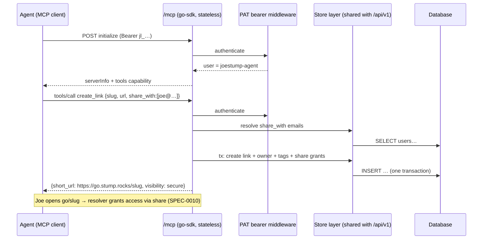

# Design: Agent Access via MCP

## Context

AI agents are regular producers and consumers of go-links in this deployment: Claude Code sessions on multiple machines, scheduled cloud agents, and a dedicated `joestump-agent` identity that already exists across the rest of the infrastructure. Today an agent that wants to mint `go/retro-notes` must hand-roll REST calls; MCP is the protocol those agents natively speak for tool use.

ADR-0018 decided the packaging: an in-process Streamable HTTP endpoint at `/mcp` inside the single joe-links binary, authenticated by existing PATs (ADR-0009 / SPEC-0006), built on the official `modelcontextprotocol/go-sdk` (Go 1.24 toolchain already satisfies it). This document covers the architecture and rationale for SPEC-0018's requirements.

A hard constraint from the 2026-07 review (issues #191–#215): joe-links has been bitten repeatedly by parallel surfaces implementing authorization independently (tag pages leaking secure links #193, UI/API share-authorization divergence #202). The MCP layer is deliberately specified as a *thin adapter* over the shared store layer — it must never become a third implementation of visibility rules.

## Goals / Non-Goals

### Goals
- One-command agent onboarding: `claude mcp add --transport http joe-links https://go.stump.rocks/mcp --header "Authorization: Bearer jl_…"`
- Full create → share → hand-off loop in a single tool call (`create_link` with `share_with`)
- Authorization identical to the REST API by construction (shared code paths)
- Agent-safe defaults: nothing an agent creates is publicly browsable unless asked
- Observable via the existing Prometheus registry

### Non-Goals
- Admin operations over MCP (user management, keyword CRUD, admin listings) — humans have the UI; agents don't need them
- OAuth 2.0 authorization-server integration per the MCP auth spec — PATs are sufficient for a self-hosted, single-tenant deployment
- stdio transport (`joe-links mcp` subcommand) — kept open by ADR-0018, not in v1
- MCP resources/prompts (e.g. a `golink://` resource scheme) — tools cover the workflows; revisit with real demand
- Slug auto-generation — agents supply slugs (they're good at it); `suggest_link_metadata` assists when wanted

## Decisions

### In-process endpoint, thin adapter over stores

**Choice**: Mount the go-sdk Streamable HTTP handler on the existing chi router at `/mcp`; tool handlers live in `internal/mcp/` and call the same store/service methods as `internal/api` handlers.
**Rationale**: Zero per-agent install, PAT middleware reuse, and — decisive after the review — a single implementation of visibility/ownership rules. See ADR-0018 for the full option analysis.
**Alternatives considered**:
- stdio subcommand as REST client: per-host install + a client-side mapping layer that can drift; rejected for v1.
- External npm wrapper: second toolchain and artifact for a single-binary project; rejected.

### Stateless JSON mode

**Choice**: Run the SDK server stateless — every POST is self-contained; no server-held sessions; GET/SSE streams may 405.
**Rationale**: Survives restarts and Caddy proxying with no affinity; v1 tools are strictly request/response, so session features buy nothing. Clients that require SSE still work through `mcp-remote`-style bridges.

### Flat, verb-named tools over one mega-tool

**Choice**: Eleven single-purpose tools (`create_link`, `share_link`, …) rather than a generic `golinks_api(action, payload)`.
**Rationale**: Small, schema-typed tools are what models select reliably; input schemas double as validation; per-tool metrics fall out for free. Inventory is capped and admin verbs are excluded, keeping the blast radius of a leaked agent token at "the token owner's links" — same as the REST API.

### `private` default (and `secure` when `share_with` present)

**Choice**: MCP `create_link` defaults visibility to `private`; providing `share_with` without a visibility bumps the default to `secure`.
**Rationale**: Agent-created links reference agent-produced artifacts; silently landing in the public Browse page (the REST default) is the wrong failure mode. `secure`-when-sharing follows from SPEC-0010: grants only gate secure links, so "share with Joe" only *means* something at `secure`. The divergence from REST is deliberate, documented in the spec, and confined to a default — explicit `visibility` always wins.
**Alternatives considered**:
- Match REST's `public` default: consistent, but wrong safety posture for autonomous writers; rejected.
- Make visibility required: extra friction on every call for the common case; rejected.

### Email as the principal reference in share/co-owner tools

**Choice**: `share_with`, `share_link`, `add_co_owner` take emails, resolved against existing users; unknown emails fail the whole call atomically.
**Rationale**: Agents know "share with joe@stump.rocks", not user UUIDs; matches the web UI's mental model. Atomic failure (no half-created link with missing grants) makes retries idempotent-ish and predictable for agents.

### Error surface: tool-result errors with REST's code vocabulary

**Choice**: Domain failures return MCP tool results with `isError` + `{code, message}` reusing REST codes (one casing — coordinate with the #205 casing cleanup); protocol errors only for malformed MCP or auth.
**Rationale**: Agents recover from tool errors in-session (pick a new slug on `duplicate_slug`); protocol errors abort sessions. Shared vocabulary means one documented error table serves both surfaces.

### Identity model: PAT = acting user; dedicated agent account recommended

**Choice**: No new identity concept. The recommended deployment pattern (documented in the docs-site guide) is a dedicated agent user (e.g. `joestump-agent` via OIDC) holding its own PAT, so agent links have honest ownership and sharing to humans is explicit; running agents on the human's own PAT also works and makes sharing a no-op.
**Rationale**: Reuses SPEC-0006 lifecycle (mint/revoke in UI, last-used tracking); ownership/audit stays truthful.

## Architecture

Component shape: `internal/mcp/` holds the server construction (tool registration, schemas, adapters) and is mounted from `internal/handler/router.go` behind the same bearer middleware used by `internal/api`. Tool adapters are ~1 store call each; anything longer belongs in the store/service layer where REST can share it.

## Risks / Trade-offs

- **SDK/protocol churn** (MCP spec revisions) → pinned official SDK; upgrades are routine dependency bumps; stateless mode minimizes surface.
- **PATs in agent config files** → same exposure as any MCP server credential; mitigations are the existing lifecycle (revoke in UI, last-used visibility) and the capped, non-admin tool inventory; recommend a dedicated agent account so a leak never exposes the human's whole account.
- **Default-visibility divergence from REST** → confined to defaults, spec'd with scenarios, and surfaced in every create result (`visibility` echoed back).
- **Stateless mode limits future server-push features** → acceptable; revisit alongside the stdio option if subscriptions ever matter.
- **New public route on the server** → auth evaluated before any MCP parsing; 1 MB body cap; same threat class as `/api/v1`.

## Migration Plan

Additive feature — no schema changes, no config required (endpoint active like `/api/v1`; `suggest_link_metadata` conditional on existing LLM config). Ships in one PR: `internal/mcp/` + router mount + integration tests + docs-site "Agents (MCP)" guide. Rollback = remove the mount.

## Open Questions

- Should a later revision add slug auto-generation on `create_link` (server-side slugify + collision suffix), or is `suggest_link_metadata` enough?
- stdio subcommand (`joe-links mcp`) demand — worth shipping for offline/local-only clients?
- If joe-links ever goes multi-tenant/public, revisit OAuth resource-server metadata (RFC 9728) for MCP-spec-compliant auth discovery.
- Expose read-only MCP resources (`golink://recent`, `golink://mine`) once a real client workflow wants context instead of tool calls?
